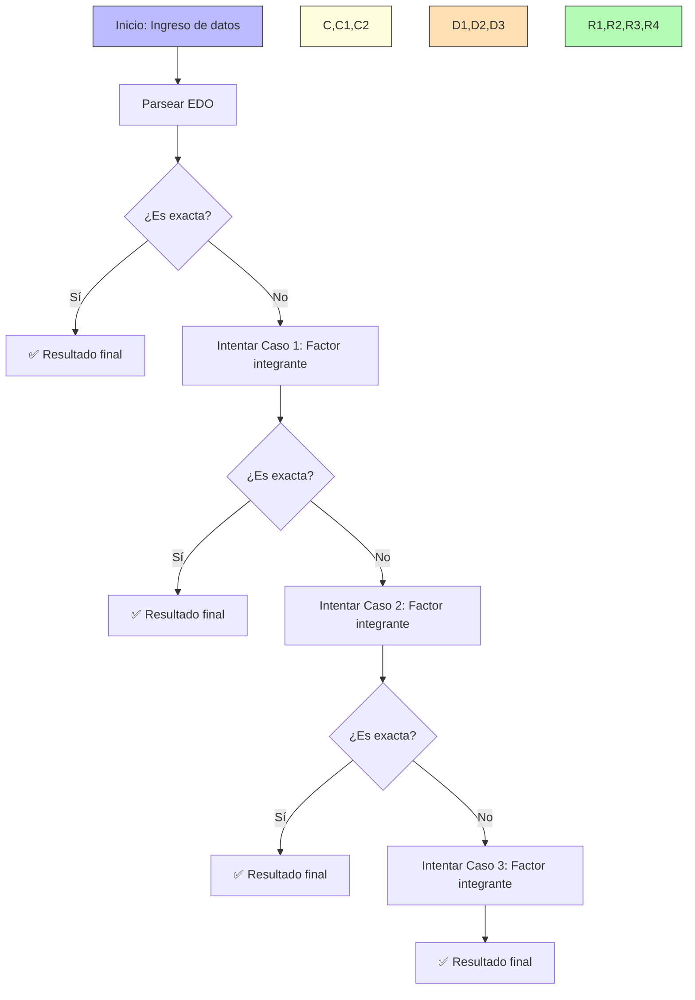

```mermaid
flowchart TD
    A[Inicio: Ingreso de datos] --> B[Parsear EDO]
    B --> C{¿Es exacta?}
    
    C -- Sí --> R1[✅ Resultado final]

    C -- No --> D1[Intentar Caso 1: Factor integrante]
    D1 --> C1{¿Es exacta?}
    
    C1 -- Sí --> R2[✅ Resultado final]
    C1 -- No --> D2[Intentar Caso 2: Factor integrante]
    D2 --> C2{¿Es exacta?}
    
    C2 -- Sí --> R3[✅ Resultado final]
    C2 -- No --> D3[Intentar Caso 3: Factor integrante]
    D3 --> R4[✅ Resultado final]

    style A fill:#bbf,stroke:#333,stroke-width:1px
    style C,C1,C2 fill:#ffd,stroke:#333,stroke-width:1px
    style D1,D2,D3 fill:#ffe0b3,stroke:#333
    style R1,R2,R3,R4 fill:#b3fbb3,stroke:#333
```